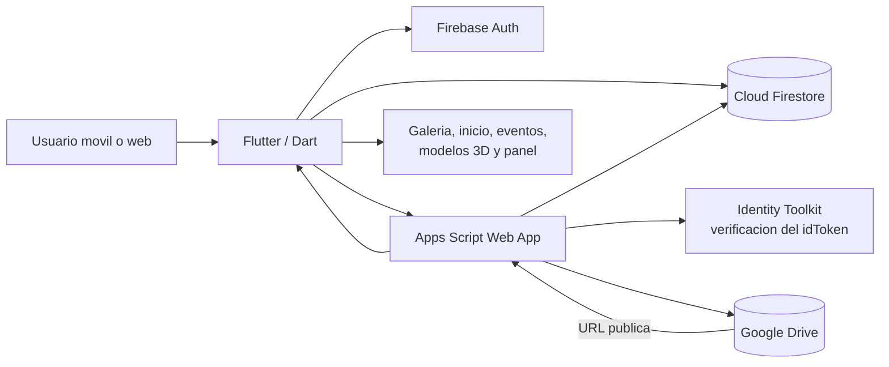
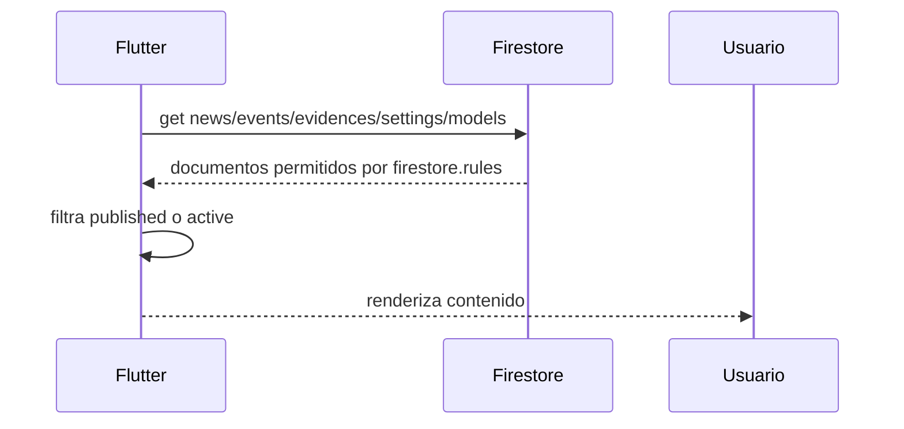
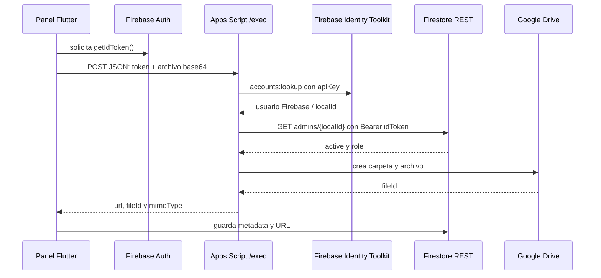
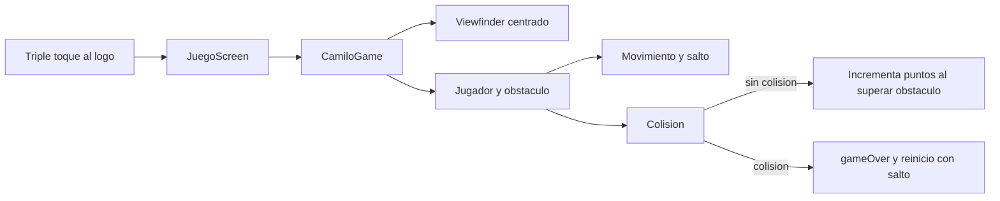

# Manual tecnico
## Camilo Verde

**Version documentada:** 1.0.0  
**Tipo de aplicacion:** Flutter multiplataforma con Firebase, Firestore, Google Drive y Google Apps Script.  
**Zona horaria del backend:** America/Bogota.

## 1. Alcance

Camilo Verde es una aplicacion institucional del proyecto PRAE. Su parte publica muestra informacion del colegio y sus actividades. El panel de administracion permite publicar contenido, subir evidencias y modelos 3D, modificar el inicio y gestionar administradores. Tambien incluye juegos locales, incluido Camilo Runner.

La aplicacion no utiliza Firebase Storage: los archivos multimedia se guardan en Google Drive y Firestore conserva sus URLs e identificadores.

## 2. Arquitectura



### Capas del proyecto

| Capa | Ubicacion | Responsabilidad |
|---|---|---|
| Arranque y navegacion | `lib/main.dart` | Inicializa Firebase, crea el tema y navega entre secciones. |
| Configuracion | `lib/config/backend_config.dart` | Lee los identificadores y endpoints mediante `--dart-define` o valores por defecto. |
| Datos publicos | `lib/services/public_content_repository.dart` | Consulta y transforma documentos publicados de Firestore. |
| Autenticacion | `lib/services/admin_auth_service.dart` | Inicio/cierre de sesion, estado del usuario y roles. |
| Administracion | `lib/services/admin_content_repository.dart` | Crea, actualiza y elimina contenido de Firestore. |
| Archivos | `lib/services/drive_upload_service.dart` | Envia archivos a Apps Script y mueve archivos a la papelera. |
| Interfaz | `lib/screens/` | Inicio, galeria, eventos, informacion, juegos, 3D y administracion. |
| Juego | `lib/game/` | Camilo Runner, movimiento, colisiones, puntos y camara Flame. |
| Puente backend | `apps-script/Code.gs` | Valida tokens, escribe en Drive y devuelve URLs publicas. |

## 3. Inicio de la aplicacion

`main()` ejecuta `FirebaseBackend.initialize()` antes de `runApp`. La inicializacion es idempotente: solo llama a `Firebase.initializeApp` si no existe una instancia previa.

`BackendConfig.options` construye `FirebaseOptions` con:

- `projectId`: proyecto Firebase.
- `apiKey`: clave publica de la aplicacion web/movil.
- `appId`: identificador de la aplicacion.
- `messagingSenderId`: identificador de mensajeria.
- `storageBucket`: `null`, porque el flujo de archivos usa Drive.

En produccion se recomienda proporcionar estos valores con `--dart-define` y no depender de los valores por defecto del repositorio.

## 4. Flujo de Firebase

### 4.1 Lectura publica



Los repositorios publicos leen:

- `news`: noticias con titulo, imagen, fecha y cuerpo.
- `events`: eventos con fecha, hora, lugar, instrucciones e imagen.
- `evidences`: evidencias con fecha, descripcion y lista de `mediaUrls`.
- `settings/home`: `videoUrl` y datos del carrusel.
- `models`: documentos cuyo `active` es `true`.

Aunque las reglas ya filtran el acceso publico, los repositorios tambien descartan documentos con `published == false` para mantener una defensa adicional en el cliente.

### 4.2 Autenticacion de administradores

1. El administrador escribe correo y contrasena en `AdminScreen`.
2. `AdminAuthService.signIn` usa Firebase Authentication con Email/Password.
3. La app consulta `admins/{uid}`.
4. El acceso al panel solo continua si `active == true`.
5. La pestaña Usuarios solo aparece si `role == superadmin`.
6. Firebase conserva el estado de sesion y `signOut` lo cierra.

### 4.2.1 Crear el primer superusuario desde Firebase Console

La aplicacion no permite crear administradores desde el panel. El primer superusuario se crea manualmente en Firebase Console:

1. Entra en [Firebase Console](https://console.firebase.google.com/) y abre el proyecto `camilo-verde-87f45`.
2. Ve a **Build > Authentication > Users**.
3. Pulsa **Add user**.
4. Introduce el correo y una contrasena temporal segura. Guarda el usuario.
5. Copia el **User UID** que muestra Firebase Authentication.
6. Ve a **Build > Firestore Database > Data**.
7. Abre o crea la coleccion `admins`.
8. Crea un documento cuyo identificador sea exactamente el **User UID** copiado. No uses el correo como identificador.
9. Agrega estos campos:

```text
email   string   correo del usuario
active  boolean  true
role    string   superadmin
```

10. Guarda el documento y vuelve a la aplicacion.
11. Entra desde el icono de candado con ese correo y contrasena.
12. Comprueba que aparezca la pestaña **Usuarios**. Esa pestaña confirma que el campo `role` fue reconocido como `superadmin`.

El documento debe quedar en la ruta `admins/{UID}`, por ejemplo:

```json
{
  "email": "admin@colegio.edu.co",
  "active": true,
  "role": "superadmin"
}
```

Para crear administradores normales, repite el procedimiento y usa `role: "admin"`. Un administrador normal puede gestionar contenido, pero no ve la pestaña **Usuarios**. La contrasena se administra en Firebase Authentication; el documento de Firestore solo define el estado y el rol.

### 4.3 Reglas de Firestore

Las reglas se encuentran en `firestore.rules` y definen:

| Coleccion | Lectura publica | Lectura admin | Escritura |
|---|---:|---:|---:|
| `news` | Solo `published == true` | Si | Admin activo |
| `events` | Solo `published == true` | Si | Admin activo |
| `evidences` | Solo `published == true` | Si | Admin activo |
| `models` | Solo `active == true` | Si | Admin activo |
| `settings` | Si | Si | Admin activo |
| `admins` | No | Si | Solo superadmin actualiza `active` y `updatedAt` |

La creacion y eliminacion directa de documentos `admins` esta bloqueada desde el cliente. El primer administrador debe crearse manualmente en Firebase Authentication y Firestore.

## 5. Conexion con Google Drive mediante Apps Script

### 5.1 Flujo de subida



`DriveUploadService` usa POST con `Content-Type: text/plain` porque Apps Script puede responder con redireccion HTTP. El servicio sigue la cabecera `location`, decodifica JSON y muestra errores si recibe HTML o una respuesta vacia.

### 5.2 Carpetas y URLs

Apps Script usa la carpeta raiz definida por `CONFIG.folderId` y crea, si no existen:

- `evidencias` para imagenes y evidencias.
- `modelos-3d` para archivos de modelos.

Las imagenes reciben una URL de miniatura `thumbnail`; los demas tipos reciben una URL de descarga `uc?export=download`. El script establece `ANYONE_WITH_LINK` con permiso `VIEW`, necesario para que la app publica pueda mostrar el contenido.

### 5.3 Eliminacion

Al eliminar un registro, `AdminContentRepository.delete` intenta enviar a la papelera los `fileIds` relacionados y despues elimina el documento Firestore. Si Drive ya no encuentra un archivo, la eliminacion del registro continua. Esto evita dejar contenido publicado por error aunque exista una inconsistencia en Drive.

## 6. Apps Script y despliegue

Archivos:

- `apps-script/Code.gs`: endpoint `doPost`, `doGet`, validacion y Drive.
- `apps-script/appsscript.json`: runtime V8 y configuracion de Web App.

Configuracion esperada de despliegue:

1. Crear un proyecto en `script.google.com`.
2. Copiar `Code.gs` y `appsscript.json`.
3. Revisar `folderId`, `firebaseProjectId` y `firebaseApiKey`.
4. Publicar como aplicacion web.
5. Ejecutar como la cuenta propietaria.
6. Permitir acceso anonimo al endpoint, ya que la autorizacion real ocurre con el `idToken` y la comprobacion de `admins`.
7. Copiar la URL terminada en `/exec` a `DRIVE_UPLOAD_ENDPOINT`.
8. Crear una nueva version cada vez que cambie Apps Script.

No se debe confundir la URL `/dev` con la URL `/exec`: `/dev` es de pruebas y normalmente exige permisos adicionales.

## 7. Modelo de datos recomendado

### Administradores

`admins/{uid}`

```json
{
  "email": "admin@colegio.edu.co",
  "active": true,
  "role": "admin",
  "updatedAt": "server timestamp"
}
```

Roles implementados: `admin` y `superadmin`.

### Noticias

```json
{
  "title": "Jornada de reciclaje",
  "body": "Descripcion de la actividad",
  "imageUrl": "https://...",
  "dateText": "2026-08-27",
  "published": true,
  "createdAt": "server timestamp"
}
```

### Eventos

```json
{
  "title": "Feria ambiental",
  "date": "2026-09-15",
  "dateText": "15/09/2026",
  "time": "09:00",
  "place": "Colegio Camilo Torres",
  "instructions": "Traer botella reutilizable",
  "icon": "event",
  "imageUrl": "https://...",
  "published": true
}
```

### Evidencias

```json
{
  "title": "Siembra escolar",
  "date": "2026-08-27",
  "description": "Registro de la actividad",
  "mediaUrls": ["https://drive.google.com/thumbnail?..."],
  "fileIds": ["id-de-drive"],
  "published": true
}
```

### Modelos 3D

```json
{
  "title": "Modelo del huerto",
  "url": "https://drive.google.com/uc?...",
  "fileIds": ["id-de-drive"],
  "active": true,
  "published": true
}
```

### Inicio

`settings/home` puede contener `videoUrl`, `carouselImageUrl`, `carouselTitle` y `carouselDescription`.

## 8. Camilo Runner

El juego es local y no guarda partidas en Firebase. `CameraComponent.withFixedResolution` usa una escena de `480x270` y centra el `Viewfinder` en `sceneSize / 2`. El parallax tiene prioridad `-1`; jugador y obstaculo prioridad `10`, para que el fondo no los cubra.



El suelo se calcula como `sceneSize.y - 86` y se comparte entre jugador y obstaculo. Los sprites utilizados estan en `assets/camilorunner/`.

## 9. Capturas y recursos visuales

Estas referencias permiten verificar rapidamente los assets y el encuadre del juego:


Para capturas de ejecucion, usar `flutter run`, abrir Administracion y el juego, y guardar las imagenes fuera de `build/`. La captura del juego debe incluir el HUD, el personaje visible, el obstaculo y el suelo.

## 10. Instalacion y validacion

```powershell
flutter pub get
flutter analyze
flutter test
flutter run
```

Para configurar valores del entorno:

```powershell
flutter run --dart-define=FIREBASE_PROJECT_ID=... --dart-define=FIREBASE_API_KEY=... --dart-define=FIREBASE_APP_ID=... --dart-define=FIREBASE_MESSAGING_SENDER_ID=... --dart-define=DRIVE_UPLOAD_ENDPOINT=https://script.google.com/macros/s/.../exec
```

## 11. Diagnostico

| Sintoma | Causa probable | Comprobacion |
|---|---|---|
| La app no inicia Firebase | Configuracion invalida o inicializacion ausente | Revisar `FirebaseBackend.initialize()` y `BackendConfig`. |
| Panel rechaza al usuario | Documento `admins/{uid}` ausente o inactivo | Revisar `active == true` y el UID exacto. |
| No se cargan noticias | Reglas, proyecto o coleccion incorrecta | Revisar Firebase Console y `firestore.rules`. |
| Apps Script devuelve HTML | URL `/dev`, despliegue privado o redireccion no seguida | Usar URL `/exec` y revisar acceso de Web App. |
| Error 401 en subida | Token expirado o invalido | Cerrar sesion, volver a entrar y verificar hora del dispositivo. |
| Archivo sube pero no aparece | URL o permiso de Drive incorrectos | Confirmar `ANYONE_WITH_LINK` y el campo `imageUrl`/`mediaUrls`. |
| Personaje no visible | Prioridad o coordenadas del mundo | Confirmar prioridades `-1` y `10`, y el `Viewfinder`. |
| Puntos no aumentan | El obstaculo no supera al jugador o el juego esta detenido | Revisar `counted`, `position.x` y `gameOver`. |

## 12. Consideraciones de seguridad y mantenimiento

- La API key de Firebase es una credencial publica de cliente, pero las reglas de Firestore son el control efectivo de acceso.
- El `idToken` nunca debe registrarse en logs ni almacenarse permanentemente.
- La cuenta que despliega Apps Script debe tener acceso a la carpeta raiz de Drive.
- No publicar archivos privados ni ampliar permisos de Drive mas alla de lectura por enlace.
- Restringir el alta de administradores a un procedimiento manual controlado.
- Antes de publicar, probar login, lectura publica, subida, eliminacion y reglas con un usuario no administrador.
- Los avisos `core/no-app` del test widget aparecen porque el test monta la app sin inicializar Firebase; el smoke test actual aun pasa, pero conviene crear mocks o inicializar Firebase en pruebas de integracion.
