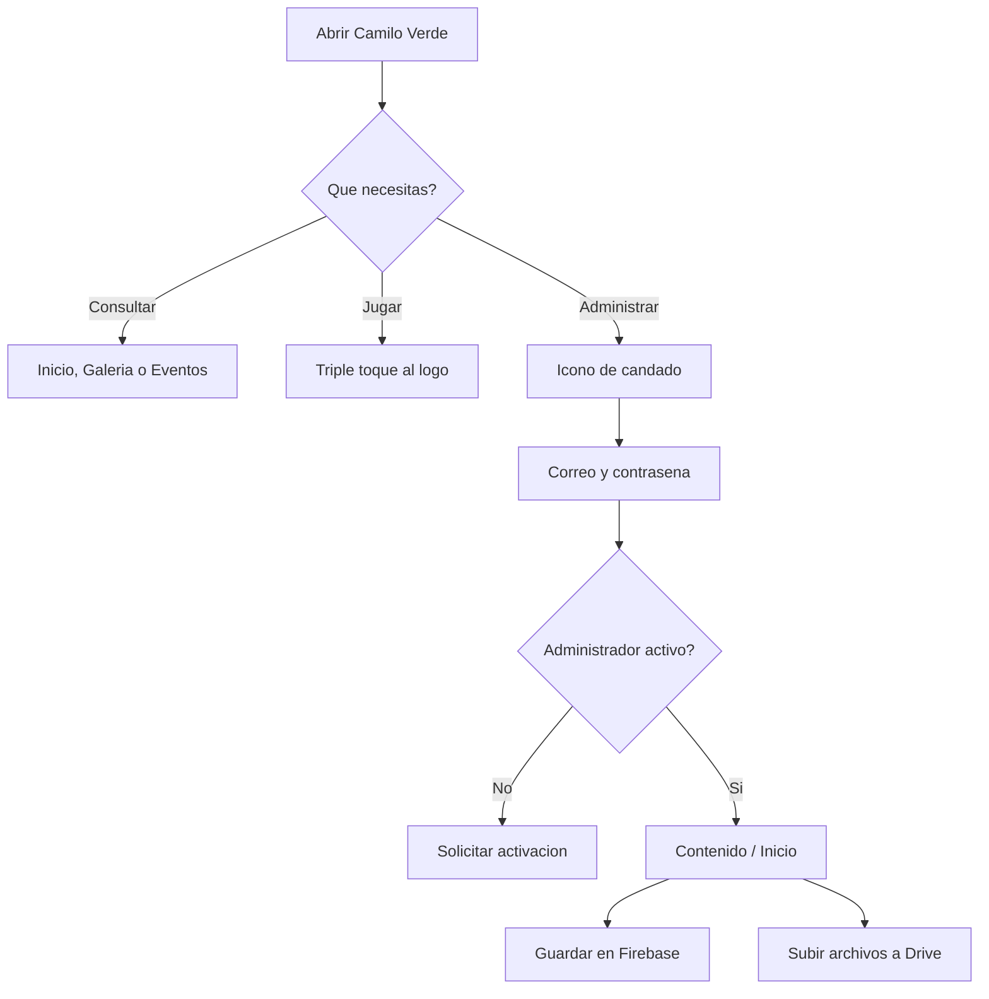

# Manual de usuario
## Camilo Verde

Camilo Verde es la aplicacion del proyecto ambiental PRAE del Colegio Camilo Torres. Desde la app puedes consultar noticias, eventos, evidencias, informacion institucional, juegos y modelos 3D disponibles.

## 1. Inicio

Al abrir la aplicacion aparece la pantalla principal con el logo, el contenido destacado y la navegacion inferior.

La barra inferior permite acceder a:

- **Inicio:** noticias, video y contenido destacado.
- **Juegos:** actividades interactivas.
- **Galeria:** fotos y evidencias de las actividades.
- **Eventos:** proximas actividades del proyecto.
- **Proximo:** espacio reservado para el contenido 3D.

El boton de informacion abre la seccion **Nosotros**. El boton de candado abre el acceso de administracion.

## 2. Consultar contenido

### Noticias

1. Entra en **Inicio**.
2. Desplazate hasta la seccion de noticias.
3. Toca una noticia para leer su contenido y ver su imagen.

Las noticias que no esten publicadas no aparecen para visitantes.

### Eventos

1. Abre **Eventos**.
2. Revisa fecha, hora y lugar.
3. Lee las instrucciones de cada actividad.

Los eventos se ordenan por fecha para mostrar primero los proximos.

### Galeria

1. Abre **Galeria**.
2. Toca una evidencia para revisar sus imagenes o videos.
3. Usa la navegacion del visor para pasar entre los archivos disponibles.

Las imagenes se cargan desde enlaces publicos de Google Drive.

### Modelos 3D

1. Entra en la seccion **Proximo**.
2. Selecciona un modelo activo.
3. Espera a que el visor cargue el archivo.
4. Gira, acerca o aleja el modelo con los gestos disponibles.

La disponibilidad depende de que un administrador haya activado el modelo.

## 3. Camilo Runner

Camilo Runner es un juego oculto dentro del logo de la aplicacion.

### Abrir el juego

1. Ve a cualquier pantalla donde aparezca el logo superior.
2. Toca el logo tres veces seguidas.
3. Se abrira la pantalla **Camilo Runner**.

### Jugar

- Pulsa **Saltar** para evitar el obstaculo.
- Tambien puedes tocar el area indicada por la pantalla si el dispositivo lo permite.
- Cada obstaculo superado suma un punto.
- Si chocas, el juego se detiene.
- Pulsa **Saltar** de nuevo para reiniciar la partida.

## 4. Acceso de administracion

El panel esta destinado a usuarios autorizados.

### Iniciar sesion

1. Toca el icono de candado.
2. Escribe el correo registrado.
3. Escribe la contrasena.
4. Pulsa **Ingresar**.

Si el usuario no esta activo, el panel no permite continuar. Solicita al responsable tecnico que revise tu cuenta.

### Publicar noticias y eventos

1. Abre la pestaña **Contenido**.
2. Entra en **Noticias** o **Proximos eventos**.
3. Pulsa el boton para agregar un registro.
4. Completa titulo, fecha y los campos solicitados.
5. Guarda el formulario.

El registro se guarda en Firebase y aparece en la aplicacion cuando queda publicado.

### Cargar evidencias

1. Entra en **Contenido > Evidencias**.
2. Selecciona una imagen desde el dispositivo.
3. Escribe titulo, fecha y descripcion.
4. Pulsa guardar.

La imagen se sube a la carpeta `evidencias` de Google Drive. La app guarda en Firebase el enlace publico y el identificador del archivo.

### Cargar modelos 3D

1. Entra en **Contenido > Modelos 3D**.
2. Selecciona el archivo del modelo.
3. Confirma la carga.
4. Verifica que el registro quede activo.

Los modelos se guardan en la carpeta `modelos-3d` de Google Drive.

### Configurar el inicio

En la pestaña **Inicio** el administrador puede:

- Cambiar la imagen, titulo y descripcion del carrusel.
- Cambiar la URL del video principal.
- Guardar los cambios para que los visitantes los vean.

Usa enlaces validos y accesibles desde internet. Si un enlace requiere iniciar sesion, la app publica no podra mostrarlo.

### Eliminar contenido

1. Busca el registro en su seccion.
2. Toca el icono de papelera.
3. Confirma la eliminacion.

Cuando el registro tiene archivos asociados, el sistema intenta enviarlos a la papelera de Drive y luego elimina el registro de Firebase.

### Gestionar usuarios

Solo un **superadmin** ve la pestaña **Usuarios**.

- Usa el interruptor para activar o desactivar a otro administrador.
- No puedes desactivar tu propia cuenta desde esa lista.
- Desactivar un usuario bloquea su acceso al panel, aunque conserve su cuenta de Firebase.

### Cerrar sesion

Pulsa el icono de salida en la esquina superior del panel.

## 5. Esquema de uso

## 6. Recomendaciones para contenido

- Usa titulos cortos y claros.
- Escribe las fechas siempre con dia, mes y año.
- Comprueba que las imagenes se vean antes de publicar.
- Para evidencias, agrega una descripcion que identifique la actividad.
- Evita borrar un registro si varias secciones usan su enlace.
- Cierra sesion al terminar en un equipo compartido.

## 7. Problemas frecuentes

| Problema | Que hacer |
|---|---|
| No aparecen noticias o eventos | Comprueba la conexion a internet y vuelve a abrir la seccion. |
| Una imagen no carga | El enlace puede estar roto o sin permiso publico; informa al administrador. |
| No puedes entrar al panel | Verifica correo y contrasena; si son correctos, solicita que activen tu usuario. |
| La subida no termina | Comprueba la conexion, reduce el tamaño del archivo y vuelve a intentarlo. |
| El modelo 3D no abre | Confirma que el archivo sea compatible y que su enlace de Drive siga activo. |
| El personaje del juego no aparece | Cierra y vuelve a abrir el juego con un reinicio completo de la app. |
| El juego termina inmediatamente | Reinicia con el boton **Saltar** y evita el obstaculo desde el inicio. |

## 8. Privacidad y permisos

El contenido publico se puede consultar sin cuenta. Las funciones de administracion requieren autenticacion con Firebase y una cuenta activa en el panel. Los archivos multimedia se muestran mediante enlaces de lectura de Google Drive; no compartas en Drive informacion que no deba ser publica.

## 9. Soporte

Al reportar un problema incluye:

- Pantalla donde ocurre.
- Accion que realizaste.
- Mensaje de error visible.
- Fecha y hora aproximada.
- Si estabas consultando, administrando o jugando.
